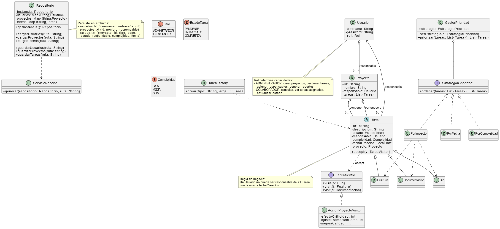

# Taller 3 - POO: Treyo

##  Integrantes
- **Axel Alcayaga** - Ingeniería Civil en Computación e Informática - 20.832.945-6
- **Vicente Rojas** - Ingeniería Civil en Computación e Informática - 22.141.463-2

##  Resumen
La empresa TaskForge Ltda. ha solicitado el desarrollo de una herramienta de gestión de proyectos para su equipo de desarrollo de software.

## Guía rápida para Eclipse

1. Importar el proyecto: `File → Import → Git → Projects from Git (with smart import) → Clone URL` e ingresar la URL del repositorio.  
2. Abrir la clase: `src/logica/Main.java`.  
3. Ejecutar `Run Main`.

## Diagramas

## Compilar en consola
mkdir -p bin
javac -encoding UTF-8 -d bin $(find src -name "*.java")

## Ejecutar en consola
java -cp bin logica.Main

